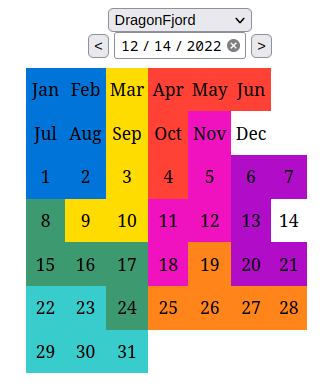

### today-puzzle

I was intrigued by this puzzle at a local math event.


So I decided to write a solution for it, and [blog about it](https://anowell.com/posts/calendar-puzzle.html).

And then extended it to work for similar puzzles.

If you just want solutions, check out the [**Interactive Solver**](https://anowell.github.io/today-puzzle/).


### Build/Run

today-puzzle is written in [Rust](https://rustup.rs/) and built with [cargo](https://doc.rust-lang.org/cargo/commands/build-commands.html).
Use [just](https://github.com/casey/just) or see the [Justfile](Justfile) for command helpers.

```
# Run to solve a specific date
# Each piece is represented by a unique letter
$ just run --date 12-25
**** 12-25 ****
A A G G G G . .
A A E E G . . .
A A E F B B B .
D D E F B H B .
C D E F F H H .
C D D . F H H .
C C C . . . . .
. . . . . . . .

# Run for all days, but only print the solution count
$ just run --all-dates --print count
01-01 has 64 solutions
01-02 has 109 solutions
01-03 has 47 solutions
01-04 has 103 solutions
...snip...

$ just run --help
Puzzle-a-day solver

Usage: today-is [OPTIONS]

Options:
  -d, --date <DATE>
          Date to solve in M-D format [default: today]

  -a, --all-dates
          Count solutions for every day of the year

  -p, --print <PRINT>
          Specifies with solutions to print

          [default: first]

          Possible values:
          - first:   Display first solution, but no count (fastest)
          - summary: Display first solution and count of solutions
          - all:     Display all solutions and count of solutions
          - count:   Display only the count of solutions
          - check:   Only prints indicator if solution exists (exits early if any day is unsolvable)

  -v, --variant <VARIANT>
          Puzzle variant

          [default: dragon-fjord]
          [possible values: dragon-fjord, crea-makerspace, jarring-words, tetromino]

  -h, --help
          Print help information (use `-h` for a summary)

  -V, --version
          Print version information
```

It can also be built to target WASM using [wasm-pack](https://rustwasm.github.io/wasm-pack/installer/).
This example uses [miniserve](https://github.com/svenstaro/miniserve) to serve files:

```
$ just wasm

# start file server (e.g. uses miniserve - could use any file server)
$ just serve

```

Then you can open your browser to `localhost:8080` to see the interactive puzzle solver.




## Performance

On my Dell XPS 13 Plus (for the DragonFjord variant):

- It takes about 150ms to find all solutions for a given date (original implementation ~1s)
- It takes about 1s to find one solution for every day of the year (original implementation ~10s)
- It takes about 30s to find all solutions for every day of the year (original implementation ~6min)

Variant differences:

- The CreaMakerspace variant is the slowest to find a single solution per date, but the fastest to find all solutions (because it has the fewest solution per date on average).
- The Tetromino variant is the fastest to find a single solution per date, but the slowest to find all solutions (because it has the most solutions per date on average).

Optimizing:

Flamegraph (`just flamegraph`) shows the time is basically split between `BitPiece::to_bitboard` and `BitBoard::has_small_gaps`.

- `to_bitboard` was the original hot loop. It was optimized with benchmarks (`cargo bench`) in [benches/bitpiece_bench.rs](benches/bitpiece_bench.rs) with the original implementation ~1.8ns vs the current implementation arround 0.8ns. It may be possible to mostly eliminate this function by just storing pieces as `u64` instead of `u16`.
- `has_small_gaps` reduced the number of `to_bitboard` calls significantly. It's implementation accounted for 5-10x speedup.
